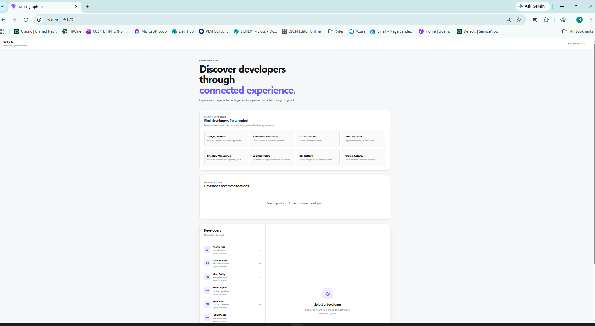
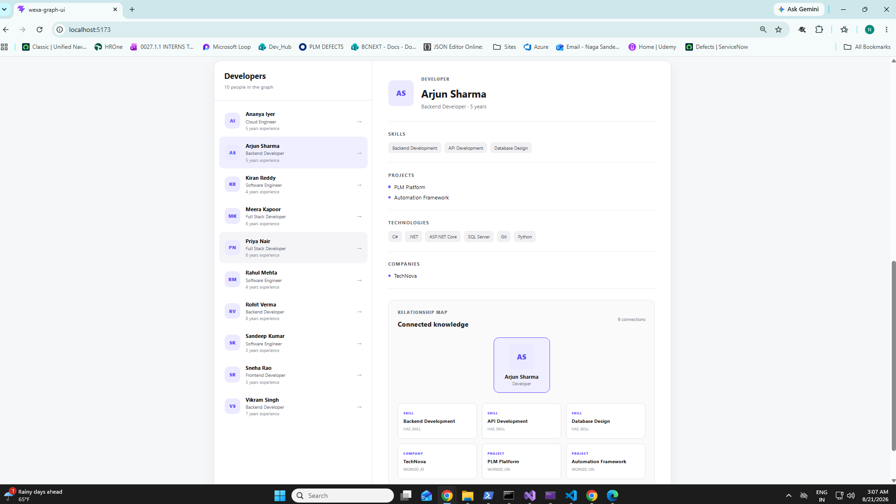
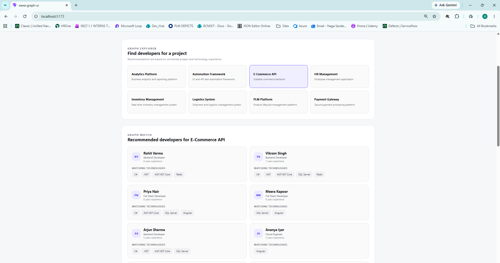

# Wexa Developer Knowledge Graph

A graph-based developer knowledge application built for the Wexa AI take-home assignment.

The application uses **CognoDB** as the graph database and provides a web interface for exploring developers, their skills, technologies, companies, projects, and relationships between them.

The application also provides graph-based developer recommendations for a selected project.

---

## Use Case

Teams often need to identify developers who are a good fit for a particular project.

A simple skill-based search might look for developers who explicitly list the same technology as the project. However, useful developer knowledge can be spread across multiple connected entities:

- Developers
- Skills
- Technologies
- Projects
- Companies

This application models those connections as a graph.

For example, if a project uses `.NET`, the application can follow relationships from the project's technologies to related technologies such as `ASP.NET Core` or `Redis`, and then identify developers who have previously worked on projects using those technologies.

This provides a relationship-based approach to developer discovery rather than relying only on direct skill matching.

---

## Why a Graph Database?

The important information in this application is not only the individual entities, but also the relationships between those entities.

A relational database could represent the same information using tables and junction tables, but queries involving several levels of relationships would require multiple joins and increasingly complex SQL.

In a graph database, relationships are first-class data.

For example:

```text
Project
   |
   | USES
   v
Technology
   |
   | RELATED_TO
   v
Related Technology
   |
   | USES
   v
Project
   |
   | WORKED_ON
   v
Developer
```

This type of traversal is a natural graph operation.

The application uses this graph structure to answer questions such as:

> Which developers have experience relevant to the technologies used by this project?

This is the primary reason a graph database is useful for this application.

---

## Key Features

- Developer directory
- Developer profile
- Developer relationship graph
- Project exploration
- Graph-based developer recommendations
- Multi-hop technology traversal
- CognoDB connectivity health check
- Realistic seed data
- Parameterized Cypher queries
- Loading states in the UI
- Empty states for no results
- API error handling
- Frontend/backend separation

---

## Technology Stack

### Backend

- C#
- ASP.NET Core
- .NET 8
- Neo4j official .NET Driver
- openCypher
- CognoDB

### Frontend

- React
- Vite
- JavaScript / JSX
- CSS

### Database

- CognoDB Cloud
- Bolt protocol
- openCypher

---

## Architecture

```text
                    ┌─────────────────────┐
                    │      React UI       │
                    │       Vite          │
                    └──────────┬──────────┘
                               │
                         HTTP / REST
                               │
                               ▼
                    ┌─────────────────────┐
                    │   ASP.NET Core API  │
                    │                     │
                    │ Controllers         │
                    │ Services            │
                    │ Repository           │
                    └──────────┬──────────┘
                               │
                         Neo4j Driver
                               │
                               ▼
                    ┌─────────────────────┐
                    │      CognoDB        │
                    │    Graph Database   │
                    └─────────────────────┘
```

---

## Graph Data Model

The application uses the following main node types:

- `Developer`
- `Skill`
- `Technology`
- `Project`
- `Company`

### Data Model Diagram

```text
                    ┌─────────────────────┐
                    │      Developer      │
                    │─────────────────────│
                    │ id                  │
                    │ name                │
                    │ role                │
                    │ experienceYears     │
                    └──────────┬──────────┘
                               │
                 ┌─────────────┼─────────────┐
                 │             │             │
             HAS_SKILL      WORKED_ON     WORKED_AT
                 │             │             │
                 ▼             ▼             ▼
          ┌────────────┐ ┌───────────┐ ┌───────────┐
          │   Skill    │ │  Project  │ │  Company  │
          │────────────│ │───────────│ │───────────│
          │ id         │ │ id        │ │ id        │
          │ name       │ │ name      │ │ name      │
          └────────────┘ └─────┬─────┘ └───────────┘
                               │
                              USES
                               │
                               ▼
                       ┌────────────────┐
                       │   Technology   │
                       │────────────────│
                       │ id             │
                       │ name           │
                       └───────┬────────┘
                               │
                           RELATED_TO
                               │
                               ▼
                       ┌────────────────┐
                       │   Technology   │
                       └────────────────┘
```

### Relationship Summary

| Relationship | From | To | Purpose |
|---|---|---|---|
| `HAS_SKILL` | Developer | Skill | Represents a developer's skills |
| `WORKED_ON` | Developer | Project | Represents projects worked on by a developer |
| `WORKED_AT` | Developer | Company | Represents company experience |
| `USES` | Project | Technology | Represents technologies used by a project |
| `RELATED_TO` | Technology | Technology | Connects related technologies |

---

## Example Graph

For example, a developer can be represented as:

```text
Developer: Arjun Sharma
│
├── HAS_SKILL → Backend Development
├── HAS_SKILL → API Development
├── HAS_SKILL → Database Design
│
├── WORKED_AT → TechNova
│
├── WORKED_ON → PLM Platform
│                    │
│                    └── USES → .NET
│
└── WORKED_ON → Automation Framework
                     │
                     └── USES → ASP.NET Core
```

This structure allows the application to explore the developer's connected knowledge rather than treating the developer as a flat record.

---

## Graph-Based Developer Recommendation

The main feature of the application is recommending developers for a selected project.

The recommendation query performs a multi-hop graph traversal.

```cypher
MATCH (p:Project {id: $projectId})-[:USES]->(t:Technology)
MATCH (t)-[:RELATED_TO*0..2]->(related:Technology)
MATCH (d:Developer)-[:WORKED_ON]->(:Project)-[:USES]->(related)

RETURN DISTINCT
    d.id AS developerId,
    d.name AS developerName,
    d.role AS role,
    d.experienceYears AS experienceYears,
    collect(DISTINCT related.name) AS matchingTechnologies

ORDER BY experienceYears DESC
```

### How the Query Works

The traversal starts from the selected project:

```text
Project
   |
   | USES
   v
Technology
```

It then follows related technologies for up to two hops:

```text
Technology
   |
   | RELATED_TO
   v
Technology
   |
   | RELATED_TO
   v
Technology
```

Finally, it finds developers who have worked on projects using those technologies:

```text
Developer
   |
   | WORKED_ON
   v
Project
   |
   | USES
   v
Technology
```

The result combines the matching technologies for each developer and orders the recommendations by experience.

The query uses the parameter `$projectId` rather than concatenating user input into the Cypher statement.

---

## Why This Query Is Interesting for a Graph Database

The recommendation query requires several relationship traversals:

```text
Selected Project
      |
      v
Project Technologies
      |
      v
Related Technologies
      |
      v
Other Projects
      |
      v
Developers
```

In a relational database, this would require several joins across project, technology, relationship, and developer tables.

The graph representation makes the relationship traversal explicit and easier to reason about.

---

## Seed Data

The repository includes realistic seed data representing:

- Developers
- Skills
- Technologies
- Projects
- Companies
- Developer/project relationships
- Project/technology relationships
- Technology relationships

The seed script is located in:

`Wexa.Graph.Api/Data/GraphSeeder.cs`

The seed operation uses `MERGE` for the main graph entities and relationships so the dataset can be loaded repeatedly without intentionally creating duplicate graph entities.

---

## Setup

### Prerequisites

- .NET 8 SDK
- Node.js
- npm
- Git
- CognoDB Cloud account

### 1. Create a CognoDB Instance

Create an account in CognoDB Cloud and create a free instance.

The instance provides:

- Bolt URI
- Username
- Password

The password should be stored securely.

**Never commit the CognoDB password to GitHub.**

### 2. Configure CognoDB Credentials

The backend expects the following configuration values:

```text
CognoDB:Uri
CognoDB:Username
CognoDB:Password
```

For local development, ASP.NET Core User Secrets are used.

Example configuration:

```text
CognoDB:Uri       = bolt+s://<instance>.databases.cognodb.com
CognoDB:Username  = cognodb
CognoDB:Password  = <your-password>
```

The actual password is not stored in the repository.

The application reads the configuration using:

```csharp
builder.Configuration["CognoDB:Uri"];
builder.Configuration["CognoDB:Username"];
builder.Configuration["CognoDB:Password"];
```

### 3. Run the Backend

Open:

`Wexa.Graph.Api/Wexa.Graph.Api.sln`

Run the project using the HTTPS profile.

The API runs locally on:

`https://localhost:7046`

### 4. Seed the Graph Database

The application does not automatically seed the database on every startup.

Instead, use the seed endpoint:

```http
POST /api/database/seed
```

For local development, the included Visual Studio HTTP file can be used:

`Wexa.Graph.Api/Wexa.Graph.Api.http`

Expected response:

```json
{
  "message": "Graph database seeded successfully."
}
```

### 5. Run the Frontend

Navigate to:

`wexa-graph-ui`

Install dependencies:

```bash
npm install
```

Start the development server:

```bash
npm run dev
```

Open the local URL displayed by Vite.

For example:

`http://localhost:5174`

---

## API Endpoints

| Method | Endpoint | Description |
|---|---|---|
| `GET` | `/api/health/graph` | Checks CognoDB connectivity |
| `GET` | `/api/developers` | Returns all developers |
| `GET` | `/api/developers/{id}` | Returns a developer profile |
| `GET` | `/api/developers/{id}/graph` | Returns the developer relationship graph |
| `GET` | `/api/projects` | Returns available projects |
| `GET` | `/api/developers/recommendations?projectId={id}` | Returns graph-based developer recommendations |
| `POST` | `/api/database/seed` | Loads the seed dataset |

---

## Example API Responses

### Graph Health

```http
GET /api/health/graph
```

Example:

```json
{
  "connected": true,
  "result": 1
}
```

### Developer

```http
GET /api/developers/dev-001
```

Example:

```json
{
  "id": "dev-001",
  "name": "Arjun Sharma",
  "role": "Backend Developer",
  "experienceYears": 5
}
```

### Developer Recommendations

```http
GET /api/developers/recommendations?projectId=project-005
```

Example response:

```json
[
  {
    "developerId": "dev-009",
    "developerName": "Rohit Verma",
    "role": "Backend Developer",
    "experienceYears": 8,
    "matchingTechnologies": [
      ".NET",
      "ASP.NET Core",
      "Redis"
    ]
  }
]
```

---

## Parameterized Queries

All database queries use parameters through the official Neo4j .NET Driver.

For example:

```csharp
new { projectId }
```

and Cypher:

```cypher
MATCH (p:Project {id: $projectId})
```

User-provided values are not concatenated into Cypher strings.

---

## Error Handling

The API handles:

- Missing required parameters
- Missing developers
- Database connectivity failures
- Database query failures
- Empty recommendation results

For example, when no developers match a project, the recommendation endpoint returns:

```json
[]
```

The frontend also provides loading and error states when communicating with the backend.

---

## Project Structure

```text
wexa-developer-knowledge-graph/
│
├── Wexa.Graph.Api/
│   │
│   ├── Controllers/
│   │   ├── DatabaseController.cs
│   │   └── DevelopersController.cs
│   │
│   ├── Data/
│   │   └── GraphSeeder.cs
│   │
│   ├── Models/
│   │   ├── Developer.cs
│   │   ├── DeveloperGraph.cs
│   │   ├── DeveloperRecommendation.cs
│   │   └── Project.cs
│   │
│   ├── Repositories/
│   │   └── GraphRepository.cs
│   │
│   ├── Services/
│   │   └── DeveloperService.cs
│   │
│   ├── Program.cs
│   ├── appsettings.json
│   ├── Wexa.Graph.Api.csproj
│   └── Wexa.Graph.Api.http
│
├── wexa-graph-ui/
│   │
│   ├── src/
│   ├── public/
│   ├── package.json
│   └── vite.config.js
│
├── .gitignore
└── README.md
```

---

## Screenshots

### Developer Directory



The application displays the available developers and allows users to explore their profiles.

### Developer Relationship Graph



The developer profile displays connected skills, projects, technologies, and companies.

### Developer Recommendations



The project view displays developers recommended using graph relationships and matching technologies.

---

## Demo

### Hosted Application

> To be added.

### Screen Recording

A short screen recording demonstrating the application will be provided as part of the assignment submission.

The recording demonstrates:

1. Opening the application
2. Exploring developers
3. Opening a developer profile
4. Viewing the relationship graph
5. Selecting a project
6. Viewing graph-based developer recommendations

---

## Security

No CognoDB passwords or credentials are committed to the repository.

Local credentials are stored using ASP.NET Core User Secrets.

The repository `.gitignore` excludes local environment and generated files.

---

## Design Decisions

### Graph Database

CognoDB was selected because the application's main operations involve traversing relationships between developers, projects, technologies, and companies.

### Parameterized Cypher

All dynamic query values are supplied as parameters rather than concatenated into Cypher.

### Service and Repository Separation

The application separates:

```text
Controller
    |
    v
Service
    |
    v
Repository
    |
    v
CognoDB
```

This keeps HTTP concerns separate from business logic and database access.

### Explicit Seeding

Database seeding is exposed through:

`POST /api/database/seed`

rather than automatically executing during every API startup.

This makes application startup predictable while keeping the seed operation reproducible.

---

## Testing

The application was tested for:

- CognoDB connectivity
- Developer retrieval
- Developer profile retrieval
- Developer relationship graph
- Project retrieval
- Multi-hop developer recommendations
- Empty recommendation results
- React UI navigation
- Developer selection
- Project selection
- Graph visualization
- Frontend/backend communication

---

## Wexa AI Take-Home Assignment

This project was created as part of the **Wexa AI Candidate Take-Home Assignment — Graph Database Application**.

The implementation demonstrates graph data modeling, Cypher querying, backend architecture, frontend development, and graph-based recommendations.
